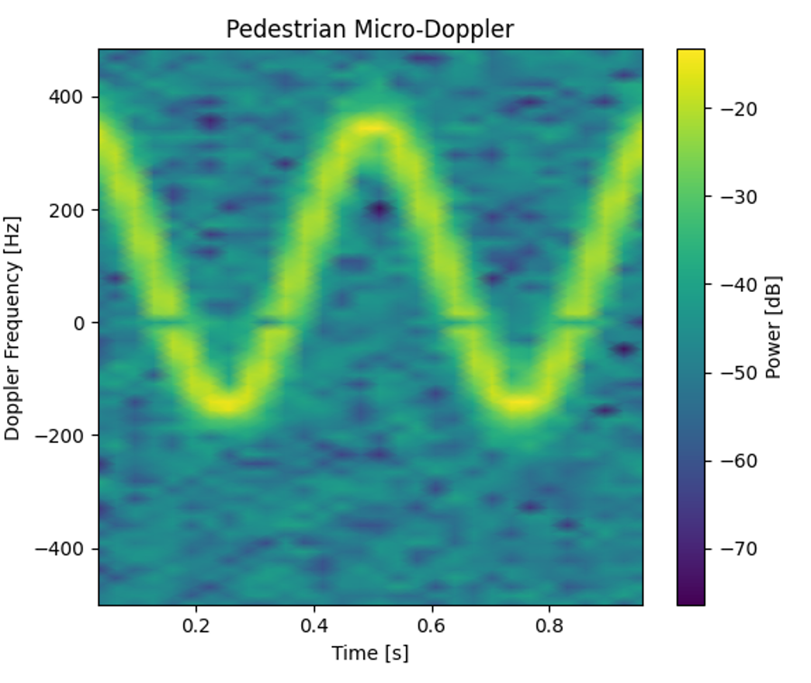

# Radar Micro-Doppler Classification with CNN
> 基于微多普勒特征的雷达目标分类系统 (PyTorch implementation)


##  项目简介 (Introduction)
本项目实现了一个端到端的雷达信号处理与深度学习分类流水线。项目模拟了 FMCW/脉冲多普勒雷达的回波信号，提取微多普勒（Micro-Doppler）时频特征，并使用卷积神经网络（CNN）对**无人机 (Drone)** 和 **行人 (Pedestrian)** 进行高精度分类。

核心功能：
* **物理仿真**：基于相位调制原理生成含微多普勒效应的雷达基带信号。
* **信号处理**：通过短时傅里叶变换 (STFT) 提取时频特征谱 (Spectrogram)。
* **深度学习**：构建轻量级 CNN 模型，在仿真数据集上达到 99%+ 准确率。

##  效果展示 (Demo)

| 无人机 (Drone) | 行人 (Pedestrian) |
| :---: | :---: |
|  |  |
| *特征：高频旋翼闪烁 (Blade Flash)* | *特征：肢体摆动产生的正弦包络* |

*(注：请在你的项目中创建一个 docs 文件夹，把之前生成的图片放进去)*

##  快速开始 (Quick Start)

### 1. 安装依赖
```bash
pip install numpy matplotlib scipy torch tqdm
```
### 2. 生成数据集运行数据生成脚本，模拟生成 1000 个雷达样本：
```bash
python make_dataset.py
```
### 3. 训练模型训练 CNN 分类器（默认 20 Epochs）
```bash
python train.py
```
# 输出示例：Test Acc: 100.00%
### 4. 实时推理加载训练好的模型，对新生成的随机信号进行预测：
```bash
python predict.py
```
